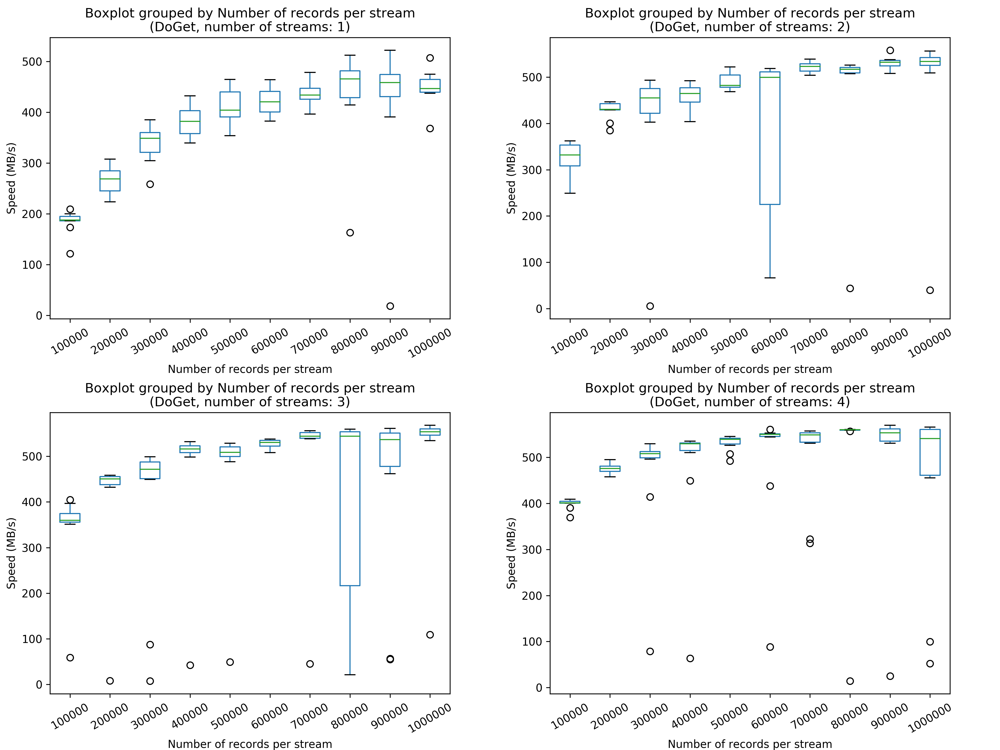
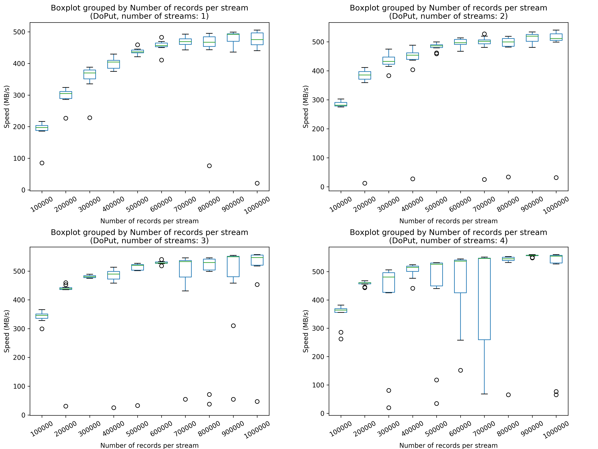

This directory contains the benchmark results of Apache Arrow Flight in different scenarios.

# Hardware
The benchmark is performed with two [AWS EC2 instances (t3a.xlarge)](https://aws.amazon.com/ec2/instance-types/).
- [vCPU](https://docs.aws.amazon.com/AWSEC2/latest/UserGuide/instance-optimize-cpu.html): 4
- Memory: 16 GB
- OS: Canonical, Ubuntu, 18.04 LTS, amd64 bionic image build on 2019-10-02
- Network Performance (Gbps): Up to 5

# Source
The [source code](https://github.com/apache/arrow/blob/master/cpp/src/arrow/flight/flight_benchmark.cc) is from the official repository of Apache Arrow.
A modified source code is included here in this directory for archiving purpose.
[Here](https://issues.apache.org/jira/browse/ARROW-7200) describes the details of a workaround to make benchmarking on two hosts possible.

# Scenarios
There is one client and one server.
The client can get data from and put data to the server via data streams.
[This doc](https://arrow.apache.org/docs/format/Flight.html#rpc-methods) explains the details of data upload/download.

The number of streams is increased from 1 to 4.
Scenarios are distinguished by the number of streams.
In each scenario, we run both the `DoGet` and `DoPut` test.

In each scenario, the number of threads and the number of streams are set to be the same.
Each thread is responsible for reading/writing one stream, and threads run concurrently.

In each scenario, the number of records per stream increases from 100000 to 1000000 with a step of 100000.

# Results
The results are stored in the `perf_stats` folder.
In each csv file, the items in each line are:
- Test type (0: Get; 1: Put)
- Number of streams
- Number of threads
- Number of records per stream
- Number of records per batch
- Data transferred from the server to the client (MB)
- Time elapsed (s)
- Speed (MB/s)

# Observations
The figure below shows the speed of data transfer from **the server to the client** in all 4 scenarios.

The figure below shows the speed of data transfer from **the client to the server** in all 4 scenarios.

The two figures demonstrate that with Apache Arrow Flight, the data transfer performance will be approaching the theoretically upper bound (5 Gbps, i.e. 625 MB/s) as the amount of data being transferred increases.
