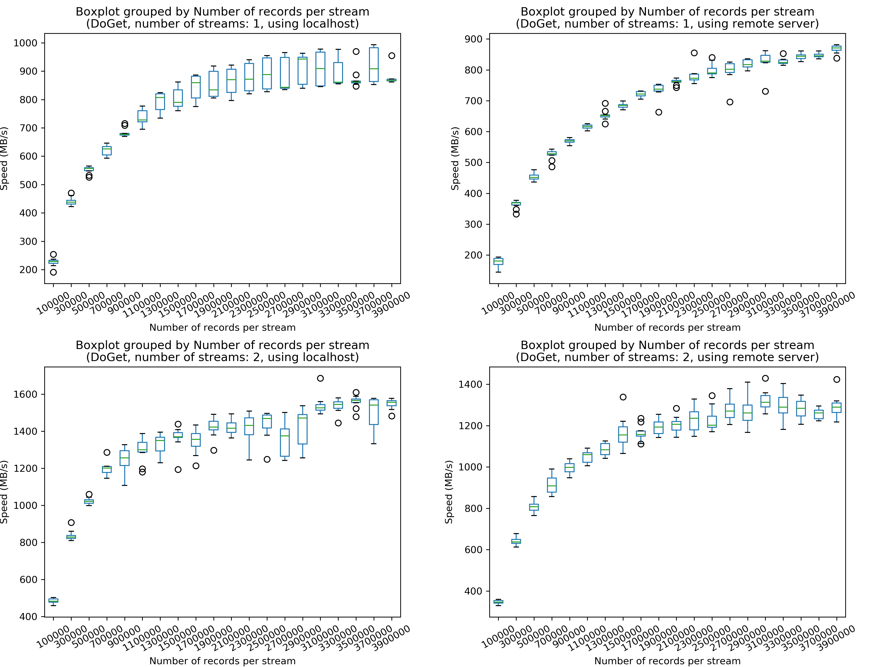
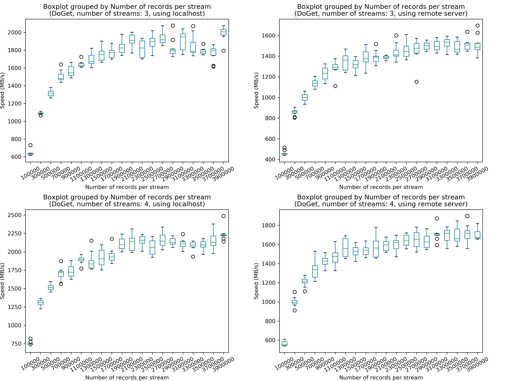
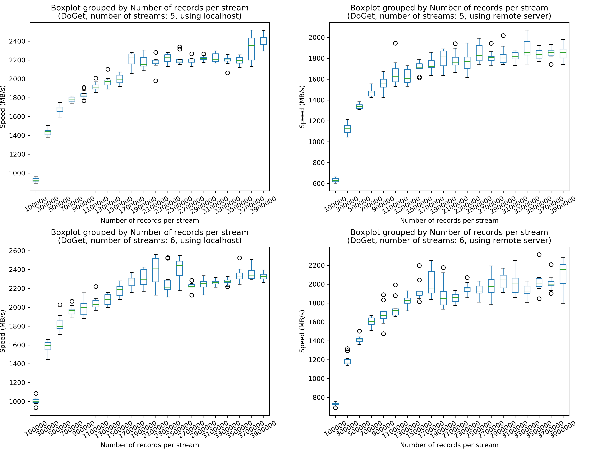
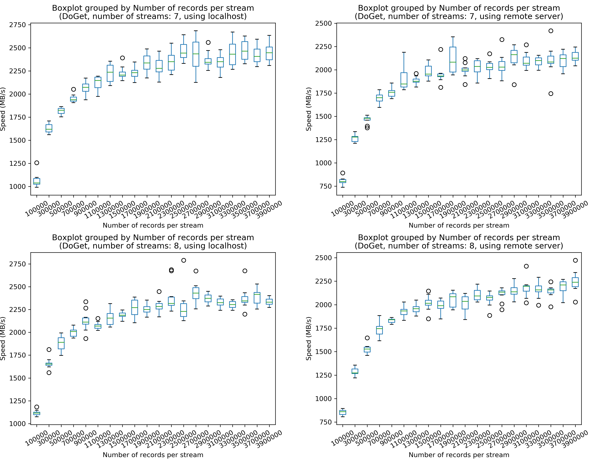

This folder contains the results of Flight benchmark on [the Dutch national supercomputer Cartesius](https://userinfo.surfsara.nl/systems/cartesius).

# How to compile and run
Cartesius has (at least) two categories of nodes:
* batch nodes
* special purpose nodes
    - interactive front end nodes
    - service nodes

## Compilation
Compilation is performed on the "interactive front end node".
[A small modification](https://github.com/apache/arrow/pull/5962) has to be made for a successful build.

The dependencies of the Flight benchmark executables are statically linked, so there are no worries regarding dependency problems.

## Execution
We need to allocate two nodes by ``salloc``. (e.g. ``salloc -N 2 -p normal -t 60``)

Then we can check the hostnames of the batch nodes allocated to us by ``srun hostname``.

Then just use ``ssh`` to log in these nodes.

It seems that a Network File System has already been set up among the interactive node and the two allocated nodes, so there is no need to copy the executables to the allocated nodes.
(I assume each node has its own CPU and memory but nodes share the same file system.)

# Results
In Arrow Flight's terminology, data is transferred via "streams".
Data is represented as "records", where each record is 32 bytes in this benchmark.

The speed at which data transfers from the server to the client in different scenarios is plotted.

The left side figures correspond to the case in which the client fetches data from localhost, while the right side figures correspond to the case in which a remote server is used.

Overall observations:
* Looking horizontally: fetching data from a remote server is slower than fetching from the localhost, but the speed is not drastically decreased.
* Looking vertically: using more streams can improve the performance, but the performance gain will saturate after the certain point.

Let's look at a concrete case:

If we want to transfers 4000000 records, we can choose from the following combinations:
* 4000000 (records per stream) * 1 (stream)
* 2000000 (records per stream) * 2 (streams)
* 1000000 (records per stream) * 4 (streams)
* 500000 (records per stream) * 8 (streams)

From the figure, the speeds are 820 MB/s, 1450 MB/s, 1850 MB/s, and 1900 MB/s, respectively (fetching from localhost); and 850 MB/s, 1250 MB/s, 1450 MB/s, and 1550 MB/s respectively (fetching from the remote server).

In this case, although the speed is not saturated in either cases (localhost and remote server), we can already see that the increase of speed is slowing down.
It can be reasonably predicted that the speed of transferring 4000000 records will converge at around 1950 MB/s (using localhost) and 1600 MB/s (using remote server) when using more streams.

# Analysis
## Why the speed can be so fast?
According to [the specification](https://userinfo.surfsara.nl/systems/cartesius/description), `Every bullx node has a Mellanox ConnectX-3 or Connect-IB (Haswell thin nodes) InfiniBand adapter providing 4 × FDR (Fourteen Data Rate) resulting in 56 Gbit/s inter-node bandwidth.`

