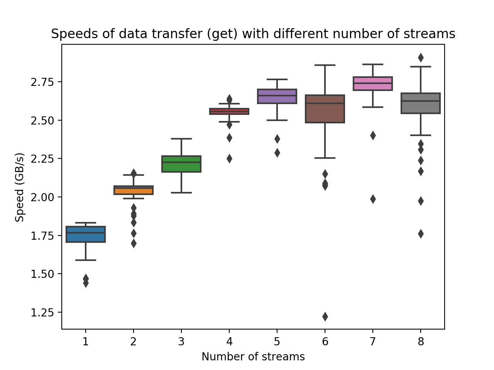
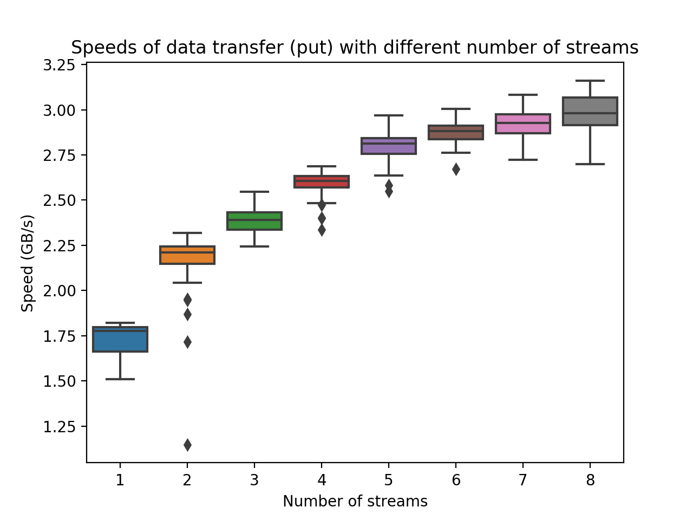

This directory contains the benchmark results of Apache Arrow Flight in different scenarios.

# Hardware
The benchmark is performed on a MacBook Pro (2018).
- Processor: 2.3 GHz Quad-Core Intel Core i5
- Memory: 16 GB 2133 MHz LPDDR3
- OS: macOS Catalina 10.15.1 (19B88)

# Source
The [source code](https://github.com/apache/arrow/blob/master/cpp/src/arrow/flight/flight_benchmark.cc) is from the official repository of Apache Arrow.
A modified source code is included here in this directory for archiving purpose.
The modification is pretty simple: it only adds one functionality: writing the benchmark result to a file, such that it can be analyzed later.

The script `run_perf_test.py` is used to automate running the tests.

# Scenarios
There is one client and one server.
The client can get data from and put data to the server via data streams.
[This doc](https://arrow.apache.org/docs/format/Flight.html#rpc-methods) explains the details of data upload/download.

The number of streams is increased from 1 to 8.
Scenarios are distinguished by the number of streams.
In each scenario, we run both the `DoGet` and `DoPut` test.

In each scenario, the number of threads and the number of streams are set to be the same.
Each thread is responsible for reading/writing one stream, and threads run concurrently.

In each scenario, the number of records per stream increases from 10000000 to 500000000 with a step of 10000000.

# Results
The results are stored in the `perf_stats` folder.
In each file, the items in each line are:
- Number of streams
- Number of threads
- Number of records per stream
- Number of records per batch
- Data transferred from the server to the client (MB)
- Time elapsed (s)
- Speed (MB/s)

# Observations
The figure below shows the speed of data transfer from **the server to the client** in all 8 scenarios.

It shows that:
- When the number of streams is less than 5, the speed increases linearly.
- When the number of streams is more than 5, increasing the number of streams does not bring higher speed.

It can also be easily noticed that doubling the number of streams does not mean the speed is also doubled.
The reason is not known yet, but here is my guess:
Threads reading the streams are not running totally independently.
They compete with each other for resources like CPU and network.

The figure below shows the speed of data transfer from **the client to the server** in all 8 scenarios.

It shows that the speed keeps increasing when more streams are used.
(The reason is unclear to me yet.)
