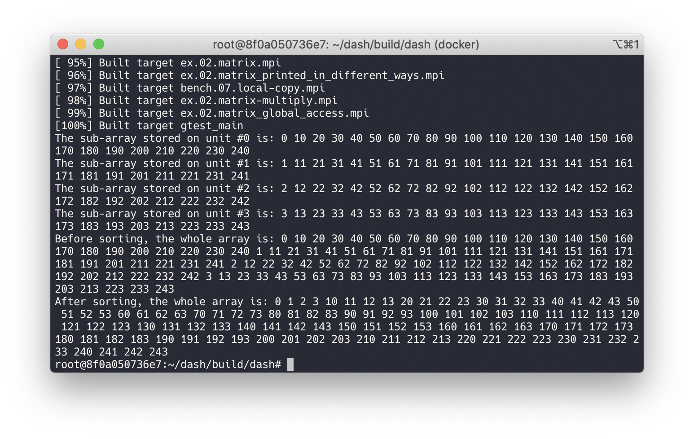

# Description
This program demostrates a simple case of using the [dash](https://github.com/dash-project/dash/) library.

# How to run

## Environment setup
I used the [Docker container](https://www.docker.com/) to set up the environment.

Note that we need to specify the `openmpi3` tag (or [other tags](https://hub.docker.com/r/dashproject/dash/tags)) when pulling the Docker image.

Before starting a container from the image, it is helpful to [mount a host directory](https://stackoverflow.com/a/24641998/5723556) to the container.
Inside the host directory we can edit sources files with our preferred editors/IDEs on the host OS.

After we get into the container using the interactive mode, it seems that we still need to manually install the library in the Docker container.
Default settings should be enough.
As far as as I recall, I used the following commands:

* `(/root)$ git clone --recursive https://github.com/dash-project/dash.git && cd dash`
* `(dash/)$ mkdir build && cd ./build`
* `(build/)$ cmake ../ && make && make install`

## Build the application
The dash library is shipped with some examples.
When installing the library, these examples are also built, and the executables are located in `~/dash/build/dash`.

The source code is located at `~/dash/dash/examples`.
A quick way to start playing with our own code is to add another folder (e.g. `ex.99.myapp`) here.
We can `cp` a `Makefile` from other examples into this folder, and all the code (that is archieved here) can be copied and pasted into `main.cpp`.
Note that we need to `cmake ../` again after adding the new folder.

Every time we update the `main.cpp`, don't forget to `make` it again.

## Execution
In the folder containing the executables:
`mpirun --allow-run-as-root ex.99.myapp.mpi`

## Screenshots
