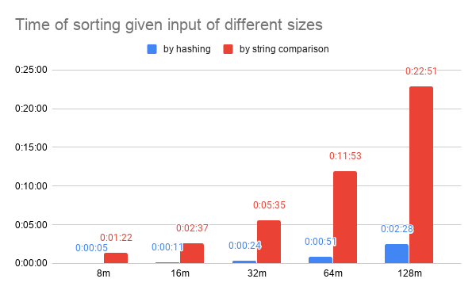

Code here is used to experiment how to speed up sorting.

`gen_records.py` generates records to be sorted.
Records would look something like this:

```
GROUP11	3082107	DATA113082107
GROUP13	0618734	DATA130618734
GROUP08	6114264	DATA086114264
GROUP02	7705361	DATA027705361
GROUP03	5450989	DATA035450989
GROUP10	6891192	DATA106891192
GROUP13	5861748	DATA135861748
GROUP10	1872666	DATA101872666
GROUP11	1177570	DATA111177570
GROUP10	6982211	DATA106982211
```

We sort the records based on their group names (primary condition; the first column above) and sequence numbers (secondary condition; the second column above).

`sort_records.cc` compares the groups names and sequence numbers directly.

`sort_hashed_records.cc` hashes the group names and sequence numbers to keys and uses the address of the records in memory as the payloads.
It then sorts the (key, payload) pairs, and later constructs the sorted records from the (key, payload) pairs.

To compile:
```
g++ -std=c++11 `pkg-config --cflags --libs gflags` sort_records.cc -o sort_records
g++ -std=c++11 `pkg-config --cflags --libs gflags` sort_hashed_records.cc -o sort_hashed_records
```

We see a huge difference in performance:


