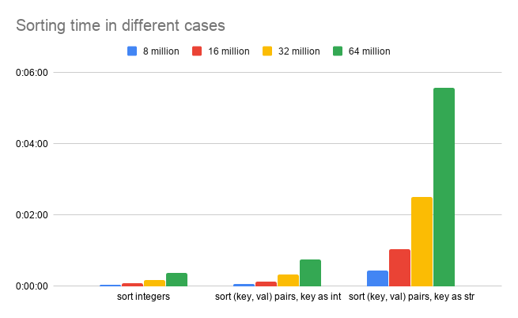

The scripts here are used to check the performance difference in sorting given different types of inputs.

`gen_ints.py` and `gen_key_vals.py` are used to generate inputs.

To sort the inputs:
`python3 sort_ints.py -i ints.txt && python3 sort_key_vals.py -i key_vals.txt -k str && python3 sort_key_vals.py -i key_vals.txt -k int`

`sort_key_vals.py` will sort the key-value pairs based on the keys: `all_records.sort_values(by=['key'], inplace=True)`

The keys can be interpreted as either numbers or strings.

The following figure shows how much time sorting takes:

When sorting the (key, value) pairs, there is a huge difference between treating the keys as integers and as strings.
This clearly shows that string comparison is more expensive than integer comparison.
