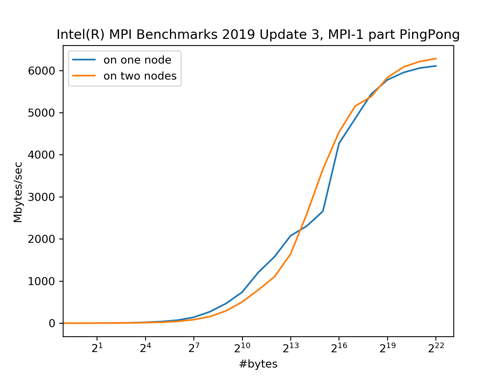

This folder contains information about the PingPong benchmark (as part of the Intel(R) MPI Benchmarks) performed on Cartesius.

``mpitest`` is used to sanity check if the MPI processes can be distributed on two nodes or not.
Its source code is also included in this folder.

```
$ mpirun -n 2 ./mpitest
Hello world!  I am process number: 1 on host tcn52.bullx
Hello world!  I am process number: 0 on host tcn52.bullx
$ mpirun -hosts tcn52,tcn53 -ppn 1 -n 2 ./mpitest
Hello world!  I am process number: 0 on host tcn52.bullx
Hello world!  I am process number: 1 on host tcn53.bullx
```

The result of of IMB PingPong is shown in the figure below.
The network performance is so good that running MPI on two nodes is as if running on the same node.


