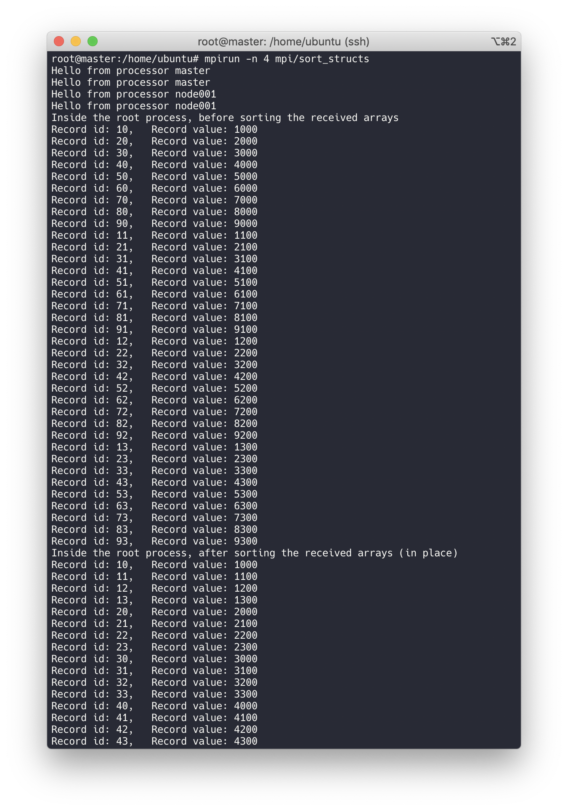
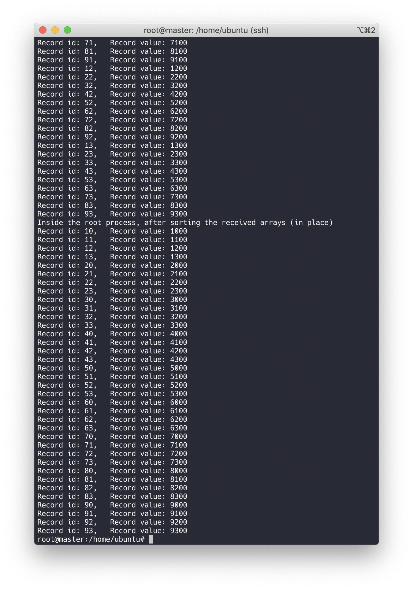

# Description
This program demostrates a simple case of distributed sorting.

The items to be sorted are records containing two fields: id and value.

The sorting is done in multiple processes.
One of them is the main/root process which gathers all the results from other processes, while the rest of the processes only sort part of the data.

Sorting is done in two phases.
In phase one, all the processes sort the records locally according to the ids.
In phase two, all processes sends their own data to the root process, where all the records are gathered and sorted globally.
Communication among the processes is managed by MPI.

# Environment Setup
[StarCluster](http://star.mit.edu/cluster/docs/latest/quickstart.html) is used for setting up the environment on [AWS EC2](https://console.aws.amazon.com/ec2/).
[This tutorial](https://mpitutorial.com/tutorials/launching-an-amazon-ec2-mpi-cluster/) teaches how to configure an MPI cluster.

# Build
There is a `Makefile` in the folder.
Just `make` it.

# Execution
`mpirun -n 4 mpi/sort_structs`

`4` is the number of the processes MPI will created.
It can be changed to other numbers if desired.

# Screenshots

# Future Work
* ~~Remove sending records from the root process to itself.~~ (Decided not to implement. Reason: The rationale behind this was to reduce communication. After a second thought, I think it is the MPI framework that should take care of this. I.e., MPI should be aware of the current process, other processes on the same node, and processes on other nodes, and decide how to share data accordingly. From the programmer's perspective such details should be hidden.)
* Implement k-way merge algorithm for phase two sorting. (Update on Oct 8, 2019: a naïve implementation of merge was done. See comments in the source code for more info.)
